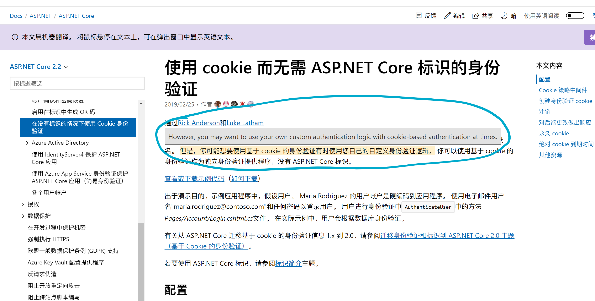
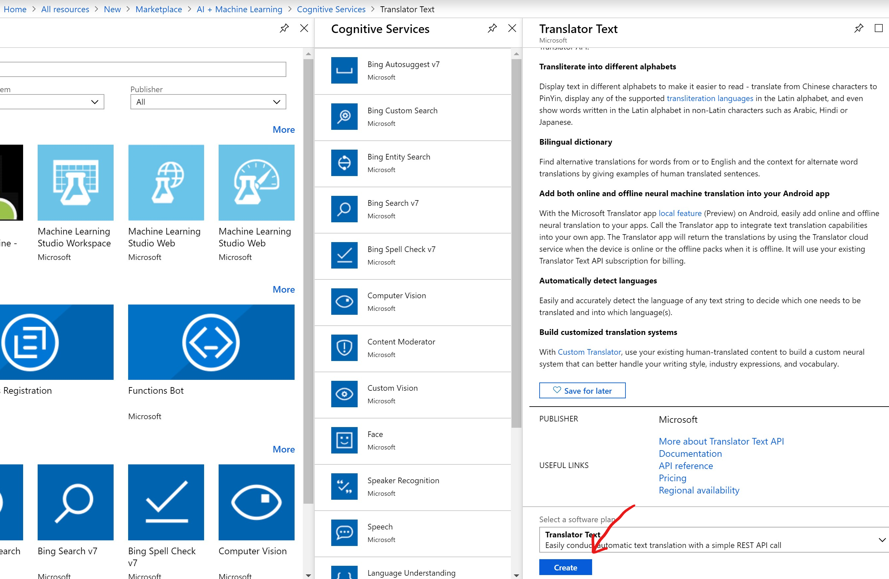
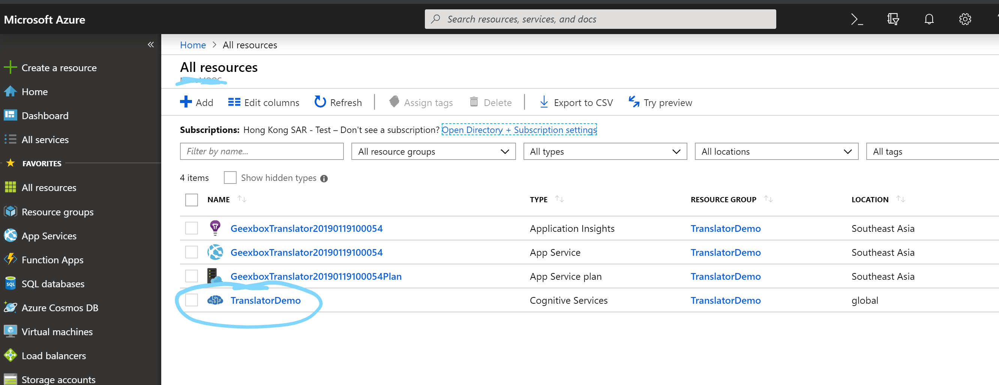
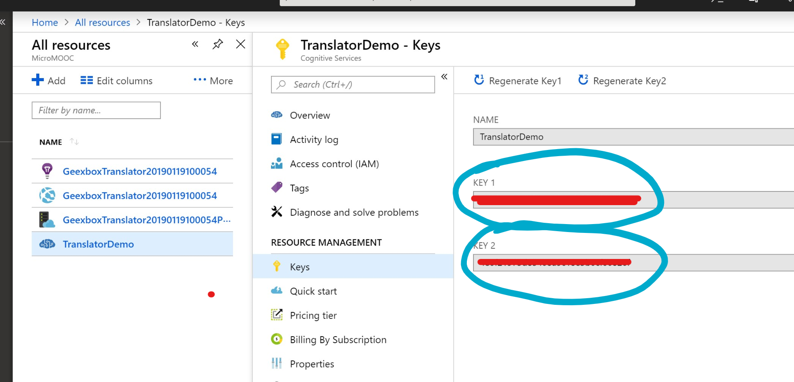
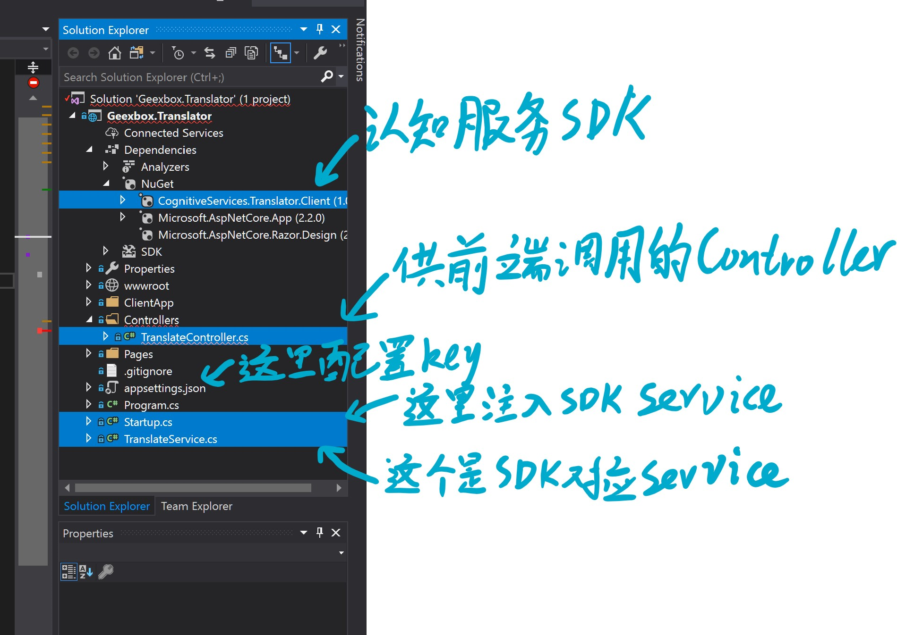
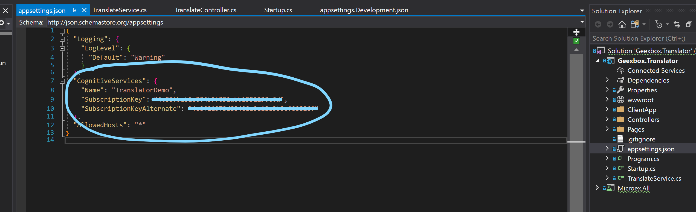
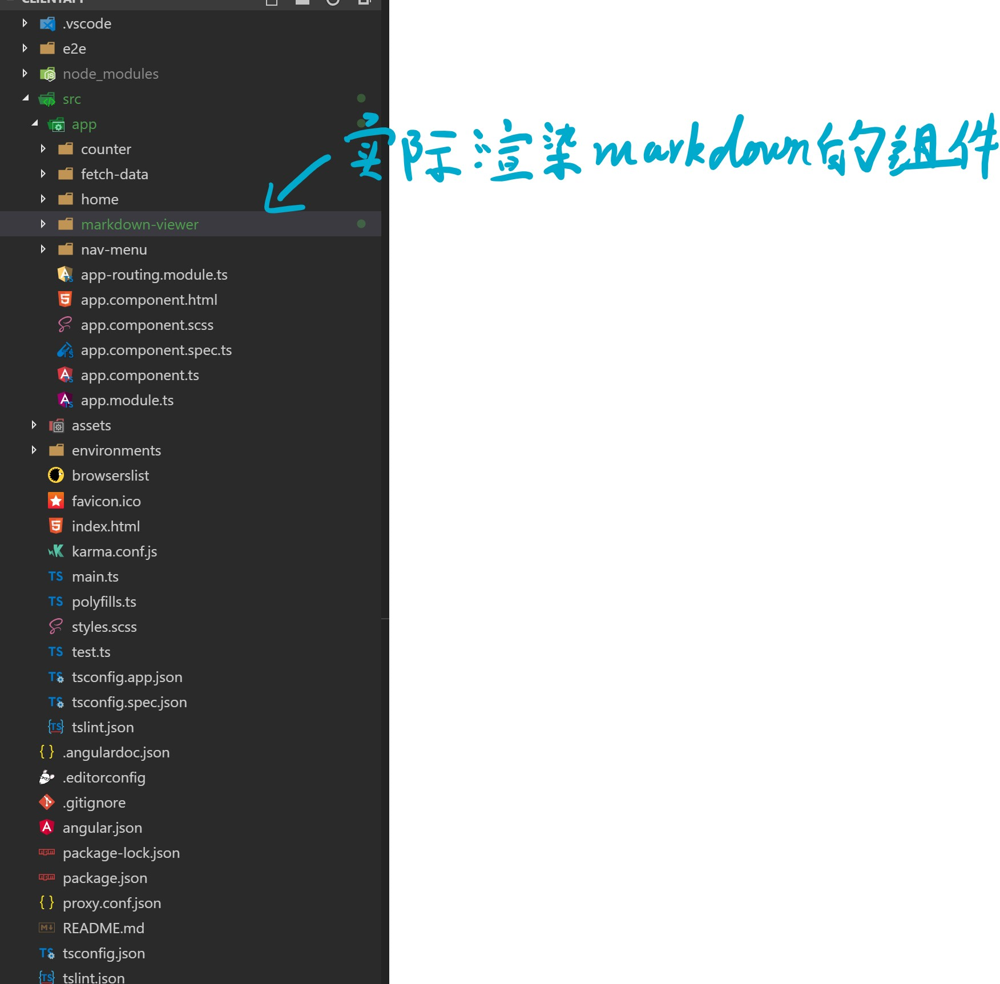
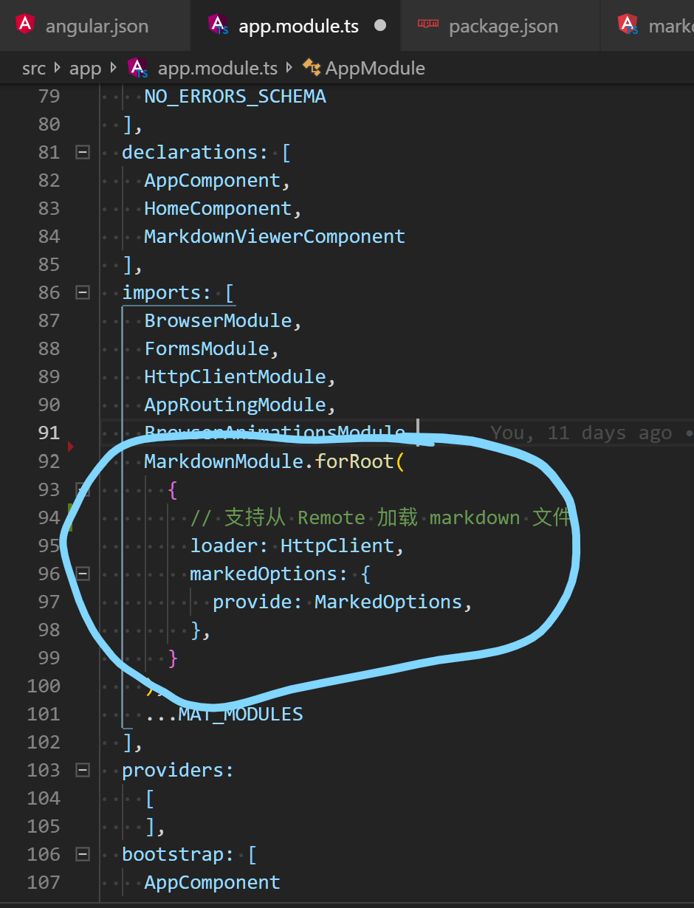
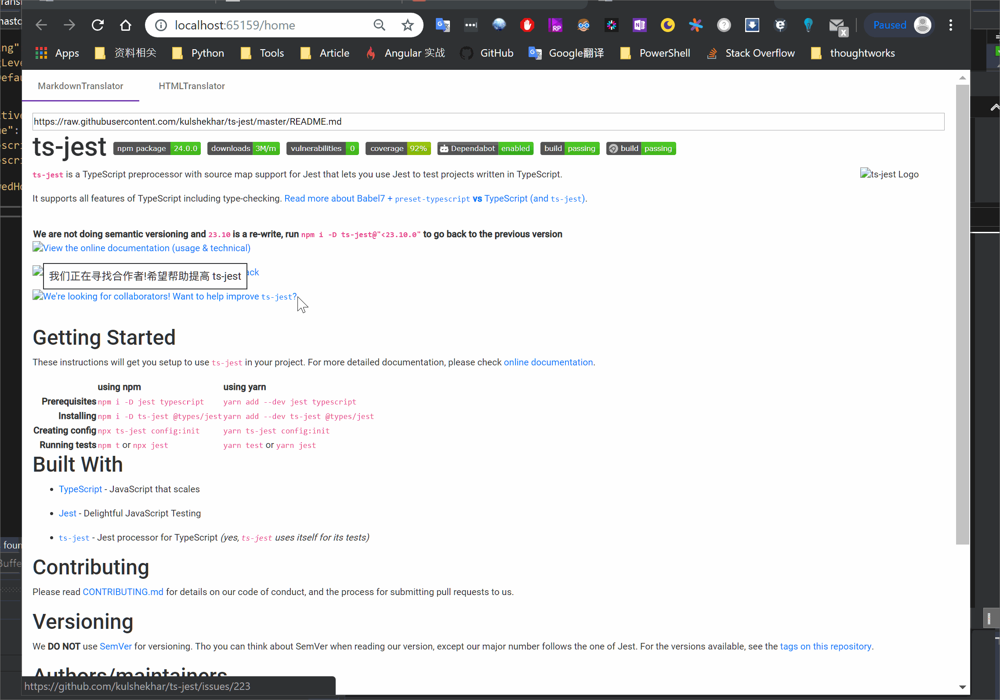

# 使用 Azure 认知服务翻译基础文本

## 什么是 **Azure 认知服务**?

**Azure 认知服务**是 API、SDK 和服务，可帮助开发人员生成智能应用程序，而无需具备直接的 AI 或数据科学技能或知识。简单来说, 开发人员可以通过对**Azure 认知服务**的调用实现一些通用的 AI 功能。

针对我们当前的应用场景，我们使用的会是**Azure 认知服务**中的`语言 API->文本翻译`。

## 大致的功能设计实现

想要实现的效果：



相关的功能点:

- 页面提供文本框，可以输入一段 markdown 文本或一个 markdown 文件的 url。
- 页面提供一个展示部分，可以预览 markdown 渲染后的 html
  - 渲染后的 html 部分，文本内容支持鼠标hover
  - hover 内容高亮并展示翻译后的内容，翻译内容在 html 渲染后异步加载
  - 代码块内容不参与翻译

实现功能的两个思路：

- [ ] 整体翻译html:
  - 优点：超级方便
  - 缺点：难以豁免部分内容(代码块)
- [x] 按节点翻译innerText
  - 优点：便于根据节点豁免内容
  - 缺点：编码麻烦

## Rock & Roll

### 第一步：注册一个国际版 Azure 订阅

不详细说明，不过有几个点需要说一下:

1. 必须是国际版 Azure，国内版本的认知服务暂时没有`语言 API`
2. 国际版 Azure 订阅绑定的微软账号不能使用RMB作为主要货币，且主要货币类型无法修改，你需要**代入非中国人的身份**来注册一个微软账号（你懂的~）。

### 第二步：开通文本翻译 API

1. [点此创建文本翻译 API](https://portal.azure.com/#create/Microsoft.CognitiveServicesTextTranslation)（如果你已经有 Azure 订阅的话）。

    

1. 在资源面板找到你新创建的文本翻译 API。

    

2. 获取文本翻译 API Key，拥有合法的Key 才能调用 API。

    

### 第三步：准备开发环境

- IDE：VS2019
- 运行时：
    |   名称    |  版本   |    备注    |
    | :-------: | :-----: | :--------: |
    | .Net Core |  2.2+   | 安装VS2019 |
    |  Node JS  | 8.15.0+ |            |
- 技术栈：
    |     名称     | 版本  |       备注        |
    | :----------: | :---: | :---------------: |
    | Asp.Net Core |   -   | .net core web api |
    |   Angular    | 7.0+  |                   |
- 第三方依赖库
  - 前端(npm)：
    |     名称     |  版本  |       备注       |
    | :----------: | :----: | :--------------: |
    | ngx-markdown | ^7.1.4 | markdown 转 html |
  - 后端(nuget)：
    |                名称                 | 版本  |             备注             |
    | :---------------------------------: | :---: | :--------------------------: |
    | CognitiveServices.Translator.Client | 1.0.0 | 第三方封装的文本翻译 API SDK |

### 第四步：Ctrl + C & Ctrl + V

~~本来想把详细编码的过程写出来的~~，写着写着发现实在太多了，这里提供源码，只讲几个个人觉得比较Interesting的点吧~

[这里会是一个打包好的代码](https://link)

后端项目的结构整体如下：



主要包括如下的几个部分：

- 认知服务 SDK

   我这里使用的 SDK 是一个第三方的封装，使用方法可以参考源码，或者官方的[Readme]([https://link](https://github.com/Nordes/CognitiveServices.Translator.Client))。

- API Key 的配置

   将之前步骤中获取到的 API Key 按照这里的结构填入即可
   

- **Translator Client**（翻译器）的使用

    ```c#
    /// <summary>
    /// 翻译文本
    /// </summary>
    /// <param name="text">待翻译的文本</param>
    /// <param name="rawDictionary">不参与翻译的字典，字典中的Key 会被翻译成对应的 Value</param>
    /// <returns></returns>
    public IList<ResponseBody> Translate(string text, IDictionary<string, string> rawDictionary)
    {
        // 这个正则用于从输入文本中查找出所有的豁免内容，豁免内容不参与翻译
        Regex re = new Regex($@"\W({string.Join("|", rawDictionary.Keys)})\W", RegexOptions.Compiled);
        // 针对需要豁免的内容，将“内容”替换为“<mstrans:dictionary translation="期望结果">内容</mstrans:dictionary>”
        // mstrans:dictionary标签内的内容不参与翻译
        string output = re.Replace(text, 
            match => rawDictionary.TryGetValue(match.Groups[1].Value, out var result) 
                ? $"<mstrans:dictionary translation=\"{result}\">{match.Value}</mstrans:dictionary>" 
                : match.Value);
        // 调用翻译 API 的客户端，获取结果
        var response = _translateClient.Translate(
            new RequestContent(output),
            new RequestParameter
            {
                From = "en", // 源语言
                TextType = TextType.Plain,// 文本内容类型，支持纯文本和html
                To = new[] { "zh" }, // 目标语言，可以一次返回多种目标语言.
            });

        // 这里会输出第一种目标语言的翻译结果
        _logger.LogDebug(response.First().Translations.First().Text);

        return response;
    }
    ```

前端项目的结构整体如下：



主要包括下面几个部分：

- 注入 markdown 转 html 的渲染模块

    

- `markdown-viewer`组件（参考源码吧，太多了，写不下去了~）


### 第五步：看看最终的效果

emmm，作为一个 demo 看起来还是挺不错了~

